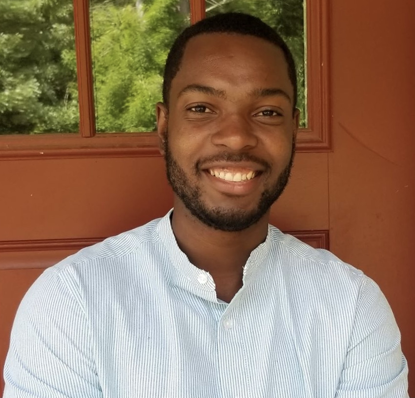

   

# About Me

***

### Welcome!

::: {.floating}
I am a first year Masters student trying to learn the ways of the computer.
I've continued my studies here at the University of New Hampshire where I also completed my BSc. 
I am currently under the supervision of Dr. Matt MacManes.

{.class width=35%}

:::

:::: {style="display: flex;"}
::: {}
Current Research work:
  [Spatial Transcriptomics analysis](SeuratAnalysis.html)

   

:::

::: {}
I'm hoping this will be formatted in a separate column. Not for any particular reason but I can imagine its usefulness in the future
:::
::::

# Research

***

I've yet to have any publications and my CV looks more like a resume but my research work is to be based on the desert cactus mouse, Peromyscus eremicus. This North American mouse has an amazing ability to resist severe dehydration and we're trying to understand how. My first research project will be analyzing the microbiota of peromyscus through RNA sequencing. 

# CV

***

More to come soon!
