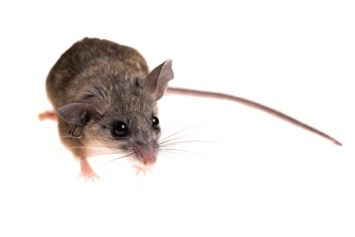

# Welcome!

***

### Bio

:::: {style="display: flex;"}
::: {}
{.class width=60%}

:::

::: {}

I am a bioinformatics focused Masters student trying to learn the ways of the computer.

I've continued my studies here at the University of New Hampshire where I also completed my BSc. 

I am currently working under Dr. Matt MacManes to understand the dehydration resistance in Peromyscus eremicus.

Bioinformatics Notes:

[Spatial Transcriptomics Notes](SpatialVis.html)

[Seurat Transcriptomics Analysis Notes](SeuratAnalysis.html)
:::
::::

 

### Research

***

:::: {style="display: flex;"}
::: {}

{.class width="2000px"}

:::
:::{}
  
This North American mouse has an amazing ability to resist severe dehydration and remains active and functional in the absence of water. When compared to the human body, which experiences organ failure following 3 days without water, this intriguing capablity is highlighted. 

To explore this ability, the members of the MacManus lab are performing spatial transcriptomics analysis of relevant genes. This type of sequencing will tell us what differentially expressed genes this mouse relies on but also where in the tissue expression occurs.

In particular my analysis will be focused on the involvment of the liver on this mices' dehydration capabilites.

:::
::::
